# C Programming for megaAVR-0 on Apple Silicon
**``By Hans-Henrik Fuxelius, 2023-05-01``

## Objectives
This guide will take you through the generic setup of the AVR C-compiler for a Mac Silicon (or Intel) computer for developing with the [ATmega4808](https://www.microchip.com/en-us/product/ATMEGA4808) microcontroller. Development is done in **SHELL**, [Visual Studio Code](https://code.visualstudio.com), [Atmel-ICE Debugger](https://onlinedocs.microchip.com/pr/GUID-DDB0017E-84E3-4E77-AAE9-7AC4290E5E8B-en-US-4/index.html?GUID-9B349315-2842-4189-B88C-49F4E1055D7F) and [GNU make](https://www.gnu.org/software/make/) (Makefile). The result will be a complete environment for serious embedded programming. 

If you do not own a barabone ATmega4808 development board, the [Arduino Nano Every](https://store.arduino.cc/products/arduino-nano-every) is an excellent start. I have also written a  "[C Programming for 'Arduino Nano Every' Board (ATmega4809) on a Mac and VS Code](https://github.com/fuxelius/nano_every_bare_metal)" that is a rewrite of this article for the Nano Every board.

## Introduction

This short introduction is based around a PCB designed specifically for SPI connection of sensors to the ATmega4808 microcontroller. This is not a limiting factor for its general adaption for generic use to other purposes and projects. This article is geared towards the **ATmega4808** and MacOS, but once the ``Makefile`` is clearly understood you could readily, with some effort, adapt it to any microcontroller from the AVR family (tinyAVR, megaAVR, XMEGA, ...) and also to Ubuntu or Fedora.

The **ATmega4808** is part of the [megaAVR® 0-Series](http://ww1.microchip.com/downloads/en/DeviceDoc/megaAVR0-series-Family-Data-Sheet-DS40002015B.pdf, which also includes ATmega808, ATmega809, ATmega1608, ATmega1609, ATmega3208, ATmega3209 and ATmega4808) that came to market in 2019. It is a modern replacement of the 20 year old ATmega328p with being better in almost every regard. It has an 8-bit AVR processor developed by Microchip/Atmel that can run up to 20MHz on an internal clock crystal. It comes with 6KB of SRAM, 48KB of flash, and 256 bytes of EEPROM. The chip features the latest technologies like flexible and efficient-power architecture, including Event System and Sleepwalking, precious analog features, and advanced peripherals.

The **ATmega4808** is programmed by the Unified Program and Debug Interface (UDPI) protocol. The  UPDI is a Microchip proprietary interface for external programming and on-chip debugging of a device. This programming can be done directly with harware tools like the [Atmel-ICE Debugger](https://onlinedocs.microchip.com/pr/GUID-DDB0017E-84E3-4E77-AAE9-7AC4290E5E8B-en-US-4/index.html?GUID-9B349315-2842-4189-B88C-49F4E1055D7F) or by software [jtag2udpi](https://github.com/ElTangas/jtag2updi#) in an embedded processor. 

The description here is general enought for setting up a pro development in C for all the AVR microcontrollers on the MacOS.

## Bare Metal Development
If you develop in Windows it is easy to get started with [Microchip Studio](https://www.microchip.com/en-us/tools-resources/develop/microchip-studio) which is free of cost and a very nice environment to work in. With that said. However. If you, like me, are used to work in an UNIX environment the locked-in Windows environment feels a bit narrow at times, especially if you are used to do development and programming on Ubuntu or MacOS. In industry Windows is standard but for many students and researchers in the academia, Apple laptops and desktops are much more common.

For those of us who are used to develop with standard C (C99) in UNIX for Apple Silicon, Ubuntu or Fedora and want to get started there are fewer alternatives than in Windows that is standard for electronics and microcontroller development. It is my hope to lower the initial steps for development of the megaAVR® 0-Series on Apple Silicon.

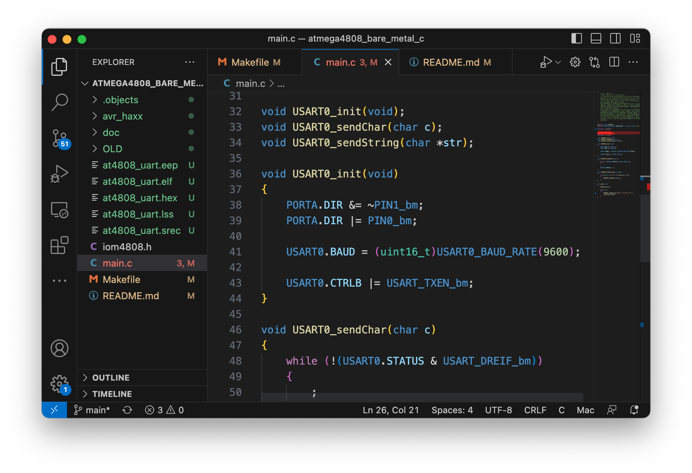

We are going to set up our environment to use [Visual Studio Code](https://code.visualstudio.com/download) as editor instead of Arduino IDE or Microchip Studio. It is superior for software development when code is running big and for working in shared project over GitHub. 

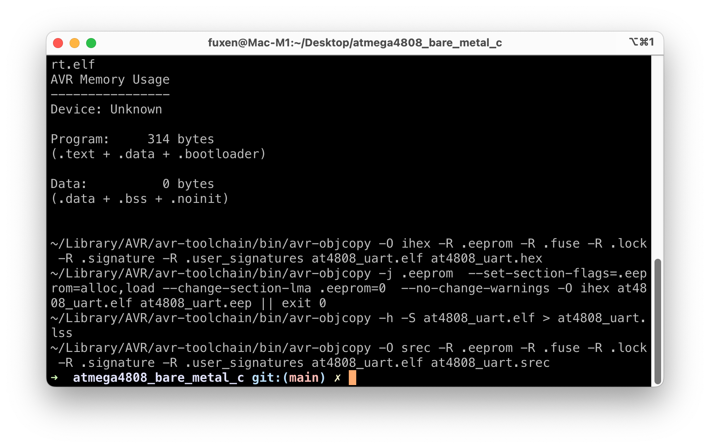

Compiling and uploading the c-code to the board takes place in *Bash* by calling a ``Makefile`` with the ``make`` command:

	make         # Compiles the C-program
	make flash   # Flash the program to the controller
	make serial  # Starts the serial monitor to the controller

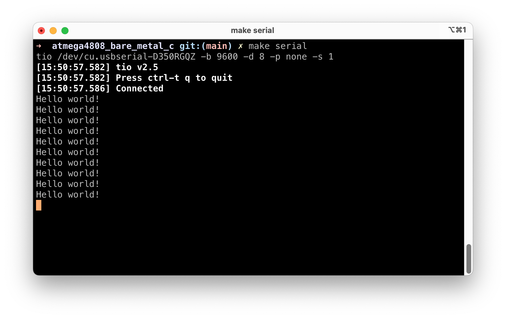

To connect to the board a serial interface is needed. We are going to use [tio](https://github.com/tio/tio) for this which is a simple serial device tool which features a straightforward command-line and configuration file interface to easily connect to serial TTY devices for basic I/O operations. To make a simpler serial device tool for talking with serial TTY devices with less focus on classic terminal/modem features and more focus on the needs of embedded developers and hackers.

## Installation, Configuration and Test
### Follow these steps to install a complete system:

### 1) Arduino IDE

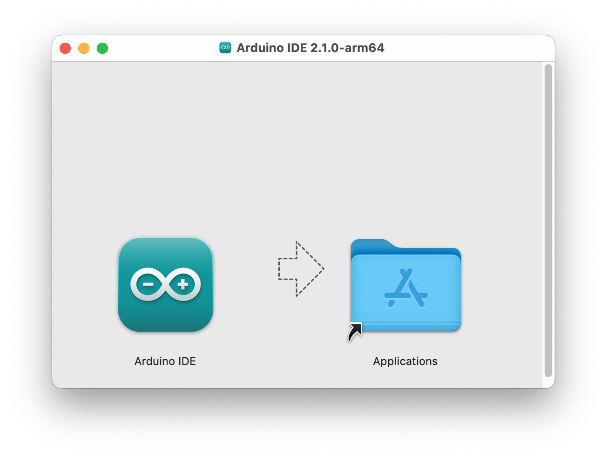

Download the latest [Arduino IDE](https://docs.arduino.cc/software/ide-v2) and install it if you have not already done so. We are going to use only its [avr toolchain](https://github.com/arduino/toolchain-avr) as **avr-gcc** compiler and other tools. 

### 2) Homebrew
You need to install [Homebrew](https://mac.install.guide/homebrew/index.html) in order to install a few crucial components to get the environment functional.

Once Homebrew is installed, install the following programs.

	brew install make
	brew install tio
	brew install avrdude
	
### 3) Install source
Install the source code from my GitHub page

	git clone git@github.com:fuxelius/atmega4808_bare_metal_c.git
	cd atmega4808_bare_metal_c

### 4) Visual Studio Code
Install [Visual Studio Code](https://code.visualstudio.com/download) and open the ``atmega4808_bare_metal_c`` directory form inside VS Code menu ``Open Folder...``.
	
### 5) Set path to avr-gcc toolchain in Arduino Library
Find out the right path to your avr-gcc binaries, and edit this path in ``Makefile``

	TOOLCHAIN_PATH = ~/Library/Arduino15/packages/arduino/tools/avr-gcc/7.3.0-atmel3.6.1-arduino5/bin
	
### 6) Test if it works

Try out this test sequence:

	make          # Compile code
	make flash    # Upload hex image
	make serial   # Connect serial to board
		
The last ``make serial`` should show scrolling lines with ``Hello world!``

If it scrolls it means **everything is working** and its all a go!
		
Quit serial with ``CTRL+T Q``

## C Development

Now that the environment is up and functional, we should take a look at how C-development takes place.

### Separate Compilation
The ``Makefile`` is set up for [separate compilation](https://users.cs.utah.edu/~zachary/isp/tutorials/separate/separate.html) which make for fast compile and linking. It will recurse through all folders  of any depth and compile and link them. 

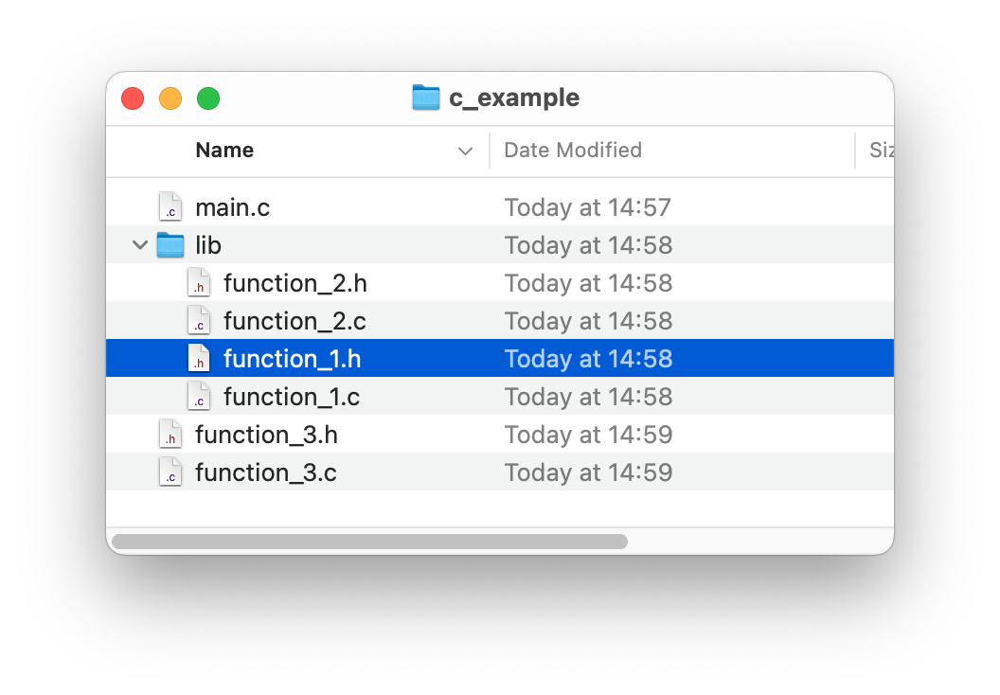

All temporary object files are placed in the ``./object`` folder to make the source-code folder less cluttered with temporary code. If you need to inspect the object-code just traverse the ``./object`` folder. 

You only have to add the header files to ``main.c`` with path and the linker resolves the rest for you.

1.  Edit your C-code

2.  Type ``make`` to separate compile the project code within the folder. This compiles all C-code and C-headers to object code and put it in the ``./object`` folder. In the same step it links it to an executable ELF file and produce the HEX image for it with the name given in the ``Makefile`` labeled ``TARGET``. 

3.  Type ``make flash`` to upload the HEX image to the microcontroller. 

4.  Type ``make serial`` to connect to the UART and lets you communicate with it.

5. GOTO 1.

* Type ``make clean`` to remove temporary object code and compiled files.

* Type ``make fuse`` to set the fuses, labeled ``FUSES`` in the ``Makefile``

* Type ``make install`` to compile and set fuses at the same time.

* Type ``make deploy`` to create an MD5-typed image with timestamp in the ``./deploy`` folder

### AVR-GCC Compiler and Libc library

Most fundamental for developing in **C** for the AVR microcontrollers is knowledge in the [avr-gcc](https://gcc.gnu.org/wiki/avr-gcc) compiler and the [AVR Libc](https://www.nongnu.org/avr-libc/user-manual/group__avr__pgmspace.html) library. The [AVR Libc 2.1.0 Manual](doc/avr-libc-user-manual-2.1.0.pdf) is absolutely crusial for understanding the capabilities of these microcontrollers. All code you find on GitHub or other resources directly or indirectly reference these. Having the [avr-gcc compiler flags](doc/avr-gcc compiler flags.html) is also necessary. 

When you read the [datasheet](doc/ATmega4808-09-DataSheet-DS40002173C.pdf) for the atmega4809 microcontroller it is handy to look at its [header file](doc/iom4809.h) for naming conventions on registers and ports in C-code so it comply with standard development on the AVR platform.

### Image Deployment
Once a HEX image is ready for the test phase it should go into deployment. 

	make deploy

In the ``./deploy`` directory you find the hex-image with its [MD5](https://en.wikipedia.org/wiki/MD5#:~:text=The%20MD5%20message%2Ddigest%20algorithm,MD5) checksum so it can be verified in the future to be a valid image without corrupted bits or bytes. 	

	.deploy/at4809_uart_20230427_192235.hex 
	.deploy/at4809_uart_20230427_192235.md5
	
	
Not knowing which image is the correct one and go into production can make it or break it. Always know which image you are testing and using for production.

## Some C Books

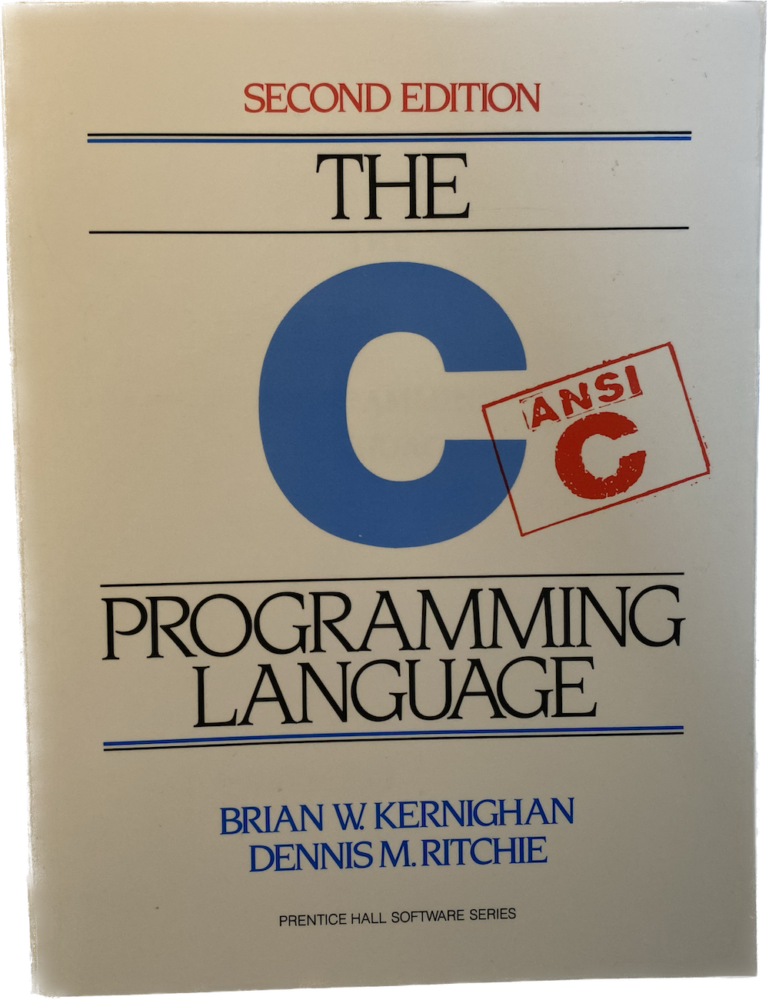 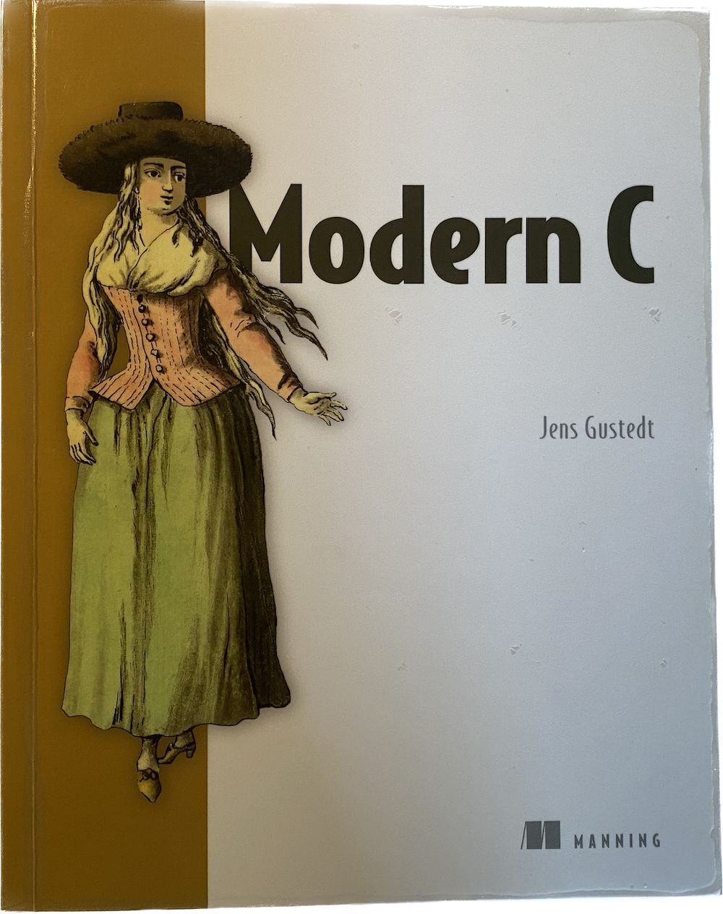 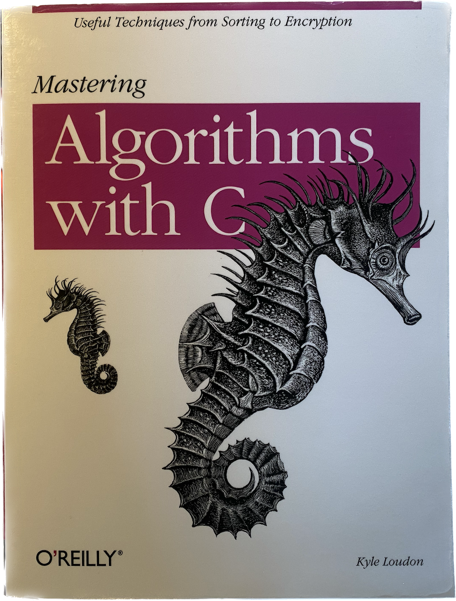

The [C Programming Language](https://www.amazon.com/Programming-Language-2nd-Brian-Kernighan/dp/0131103628) (sometimes termed K&R, after its authors' initials) is a computer programming book from 1978 written by **Brian Kernighan** and **Dennis Ritchie**, the latter of whom originally designed and implemented the language, as well as co-designed the Unix operating system with which development of the language was closely intertwined. The book was central to the development and popularization of the C programming language and is still widely read and used today. Because the book was co-authored by the original language designer, and because the first edition of the book served for many years as the de facto standard for the language, the book was regarded by many to be the authoritative reference on C. Its old but still a good read if you find it cheap in the thrift shop!

[Modern C](https://www.amazon.se/Modern-C-Jens-Gustedt/dp/1617295817) by **Jens Gustedt** 2019. Modern C introduces you to modern day C programming, emphasizing the unique and new features of this powerful language. For new C coders, it starts with fundamentals like structure, grammar, compilation, and execution. From there, you’ll advance to control structures, data types, operators, and functions, as you gain a deeper understanding of what’s happening under the hood. In the final chapters, you’ll explore performance considerations, reentrancy, atomicity, threads, and type-generic programming. You’ll code as you go with concept-reinforcing exercises and skill-honing challenges along the way. Modern C focuses on the new and unique features of modern C programming. The book is based on the latest C standards and offers an up-to-date perspective on this tried-and-true language. This is an updated and extended version of Kernighan & Ritchie, and covers everything and more. Its style covers perfectly embedded development in C. Get it!!

[Algorithms With C](https://www.amazon.se/Mastering-Algorithms-C-Kyle-Loudon/dp/1565924533/ref=sr_1_9?crid=ZTTNRRAL9B08&keywords=algorithms+with+c&qid=1682612292&sprefix=algorithms+with+c%2Caps%2C159&sr=8-9) by **Kyle Loudon** shows you how to use essential data structures such as lists, stacks, queues, sets, trees, heaps, priority queues, and graphs. He explains how to use algorithms for sorting, searching, numerical analysis, data compression and data encryption. A little goldmine for embedded development!

## Makefile internals

``TARGET``: The name of the project, resulting name is ``TARGET.hex``. Change it to a proper name for your project

``CLOCK``: The fuses are set to 16MHz and default for 4809 is to divide by 6 that gives 2666666

``FUSES``: These are given in the [datasheet](doc/ATmega4808-09-DataSheet-DS40002173C.pdf)

``DEVICE``: You can get the proper name to support other AVR MCUs than 4809 in [Microchip Packs Repository](https://packs.download.atmel.com)

``PARTNO`` that goes into the [avrdude](https://github.com/avrdudes/avrdude#) command line comes from the list of supported AVR microcontrollers in the avrdude [manual](https://avrdudes.github.io/avrdude/) . Here you can find all supported devices. So ``m4809`` is a short for ATmega4809. If you want to use another microcontroller, just look it up in the list.

Unless you get ``DEVICE`` and ``PARTNO`` right it will not compile and upload correctly, it is bad at guessing.

``TOOLCHAIN_PATH``: This refers into the library directory of the Arduino distribution, ``~/Library/Arduino15/packages/arduino/tools/avr-gcc/7.3.0-atmel3.6.1-arduino5/bin``. A problem with this is that it can change if a new Arduino IDE installation takes place and removes the old one. A remedy to this is to copy the AVR toolchain out of Arduino IDE to a safe place in ``~/Library``:

	cp ~/Library/Arduino15/packages/arduino/tools/avr-gcc/7.3.0-atmel3.6.1-arduino5/bin \
	    ~/Library/AVR/avr-toolchain/

``AVR_HAXX_PATH``: This should not really reside in the same folder as the code, but shold be moved to the same folder as ``TOOLCHAIN_PATH`` resides in, so:

	mv avr_haxx ~/Library/AVR/avr_haxx

Now AVR toolchain resides ``~/Library``. The compiler suite will not be corrupted or change over time, even if we switch, update or reinstall the computer.

	~/Library/AVR/avr-toolchain/...
	~/Library/AVR/avr_haxx/..
	
The updated paths in the ``Makefile`` should look like:

	TOOLCHAIN_PATH  = ~/Library/AVR/avr-toolchain/bin
	AVR_HAXX_PATH   = ~/Library/AVR/avr_haxx	
	
The C-project folders now only need the ``Makefile`` and C-code to compile and flash.

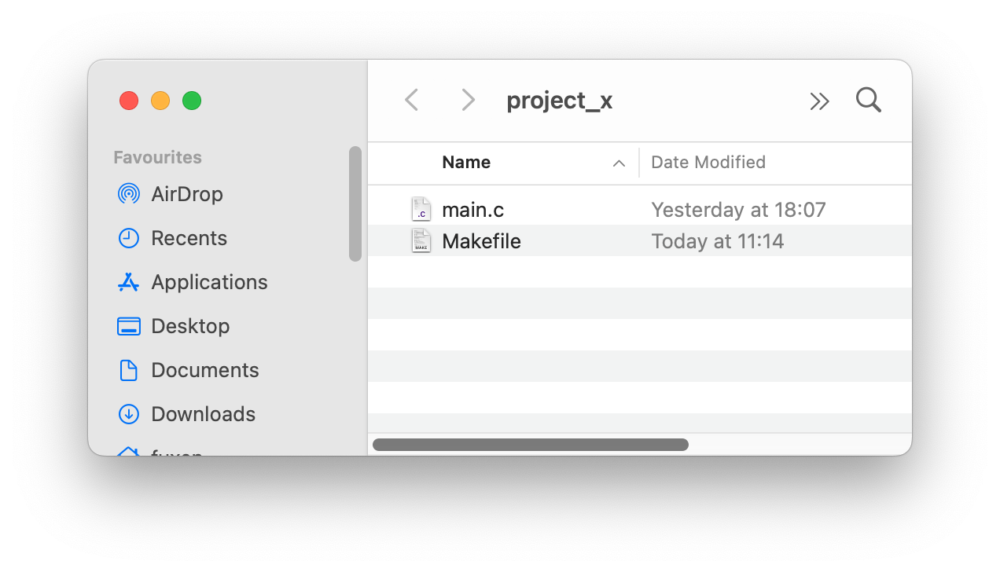

To understand and further develop the ``Makefile`` you need to learn how [makefiles](https://makefiletutorial.com) work. It is a bit tricky for young players, but once you got the hang of it, its really makes the day!

### AVRDUDE
[AVRDUDE](https://github.com/avrdudes/avrdude#) - AVR Downloader Uploader - is a program for downloading and uploading the on-chip memories of Atmel’s AVR microcontrollers. It can program the Flash and EEPROM, and where supported by the serial programming protocol, it can program fuse and lock bits. AVRDUDE also supplies a direct instruction mode allowing one to issue any programming instruction to the AVR chip regardless of whether AVRDUDE implements that specific feature of a particular chip. For changing parameters in AVRDUDE have a look in the [manual](https://avrdudes.github.io/avrdude/).

We use a locally installed version of AVRDUDE and not the one in the Arduino avr-gcc toolchain.

## Support of Other AVR Microcontrollers

The ``avr_haxx`` has included files to support the whole range of [megaAVR® 0-Series](http://ww1.microchip.com/downloads/en/DeviceDoc/megaAVR0-series-Family-Data-Sheet-DS40002015B.pdf) of microcontrollers:

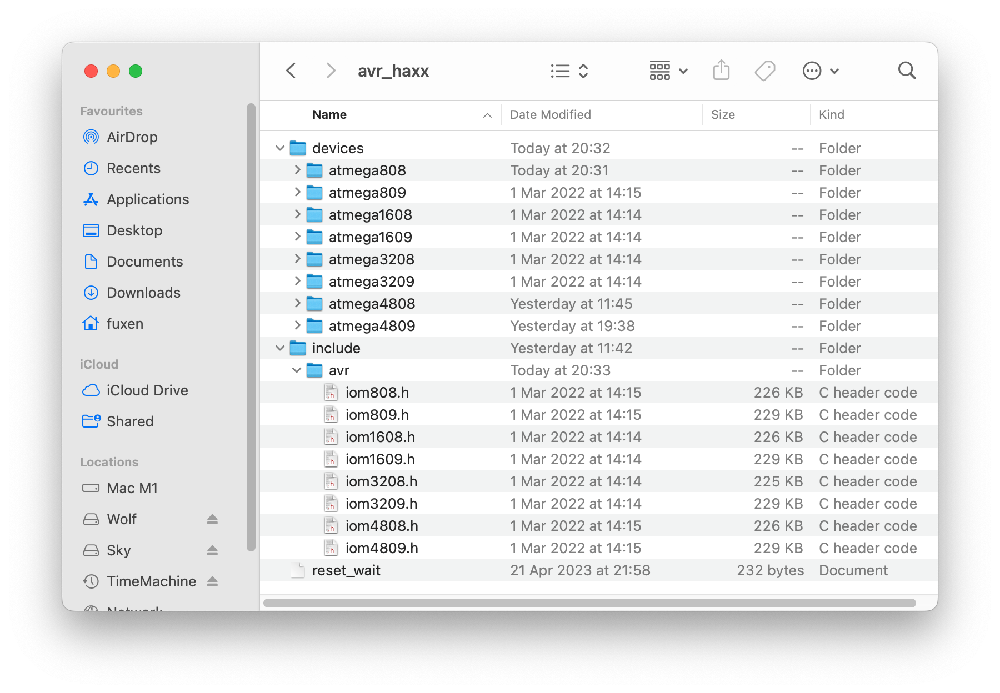

If you want to add support for other microcontrollers from AVR you can peek into [Microchip Packs Repository](http://packs.download.atmel.com) and click on the links to find your controller. When you have found it, download the pack to your computer. It is called something like ``Microchip.ATmega_DFP.3.0.158.atpack``. It's really just a zip archive with ``.atpack`` extention so rename it to ``.zip`` and unpack it and enter into its directory.

* Copy the relevant microcontroller folder from ``Microchip.ATmega_DFP.3.0.158.atpack/gcc/dev/`` to the local ``avr_haxx/devices`` folder

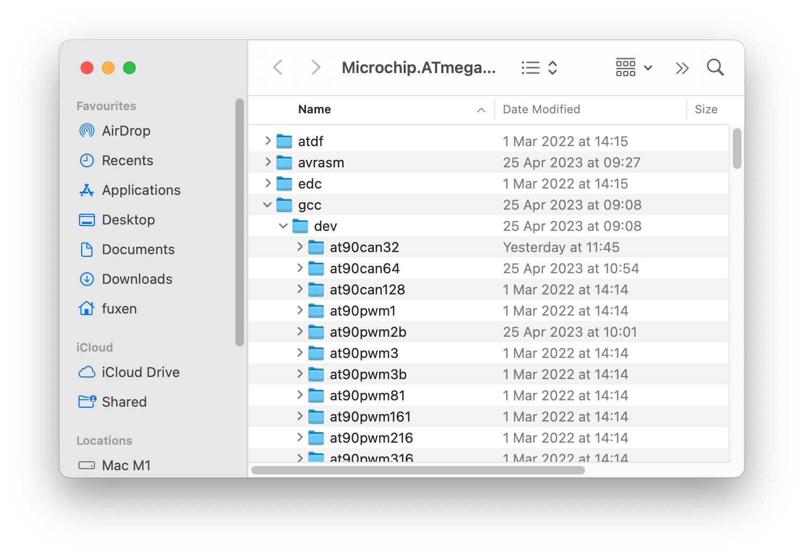

* Copy the relevant microcontroller header from ``Microchip.ATmega_DFP.3.0.158.atpack/include/avr/`` to the local ``avr_haxx/include/avr/`` folder

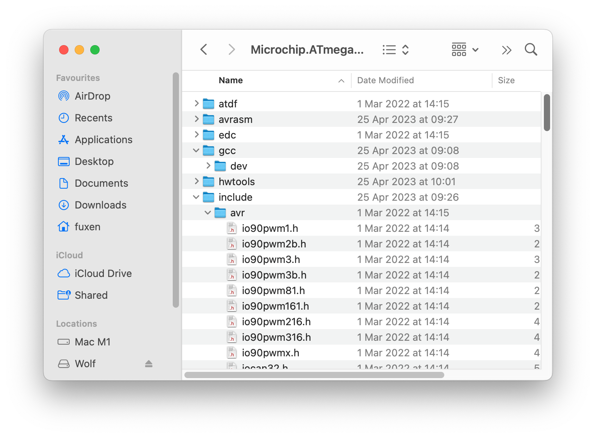

Remember to also make the relavant changes to the ``Makefile`` for it to work! You need to update ``DEVICE``, ``PARTNO``, ``CLOCK``, ``FUSES``, ``PROGRAMMER`` and compiler flags

## References and Further Resources

### Far Inside The Arduino: Nano Every Supplement

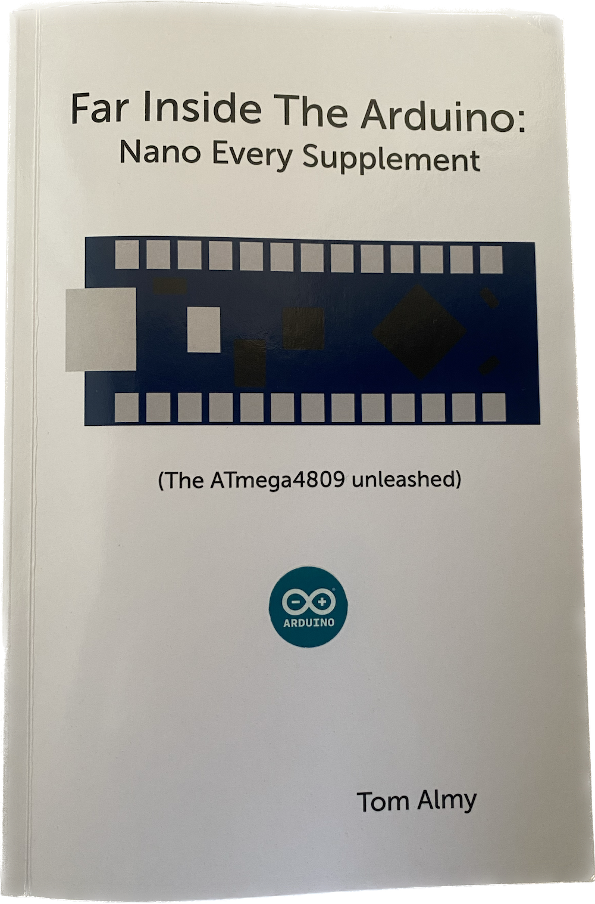

**Tom Almy** has a written an excellent book ([Far Inside The Arduino: Nano Every Supplement](https://www.amazon.com/Far-Inside-Arduino-Every-Supplement/dp/B08GFL6VBF/ref=sr_1_1?crid=1ATDVO5JQV8GI&keywords=Far+Inside+The+Arduino%3A+Nano+Every+Supplement&qid=1682675028&sprefix=far+inside+the+arduino+nano+every+supplement%2Caps%2C202&sr=8-1)) on the internals of the Nano Every board and have a [homepage](https://tomalmy.com/category/arduino-nano-every/) that is updated regularly on the Arduino Nano Every board and software projects conneted to it. He has some interesting blog posts about [FreeRTOS](https://www.freertos.org/microchip-atmega-0-demo.html) on the ATmega4809 (Arduino Nano Every)

